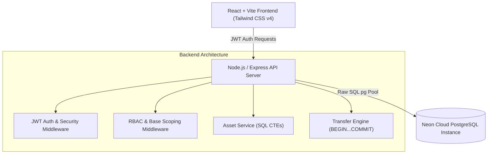
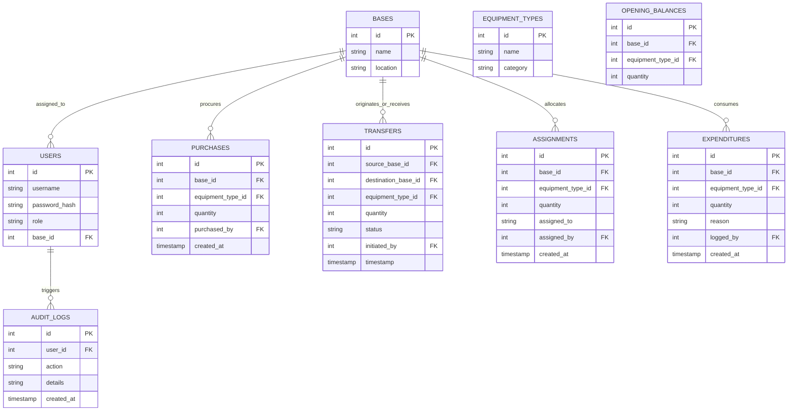

# 🛡️ Military Asset Management Command System
## Comprehensive Technical Documentation & Submission Report

---

## 🌐 EXECUTIVE SUMMARY & HOSTED ENDPOINTS

The **Military Asset Management Command System** is an enterprise-grade full-stack web application built to enforce real-time military stock auditability, ACID-compliant cross-base equipment transfers, strict Role-Based Access Control (RBAC), and interactive metric decomposition.

- **Frontend Application (Vercel)**: `https://military-asset-management-system.vercel.app` (or local `http://localhost:5174`)
- **Backend API Service (Render)**: `https://military-asset-management-system-f9tj.onrender.com` (or local `http://localhost:5000`)
- **Live Database Engine**: Hosted **Neon Cloud PostgreSQL** (`ep-old-leaf-axwdugg3-pooler.c-4.us-east-2.aws.neon.tech/neondb`)
- **GitHub Repository**: `https://github.com/Abhisek1233/Military-Asset-Management-System.git`

---

## 1. SYSTEM ARCHITECTURE & TECHNOLOGY STACK



### Architectural Decisions & ORM Justification
> [!IMPORTANT]
> **Why Raw SQL (`pg` pool) was chosen over Prisma or TypeORM:**
> In military cross-base transfers, equipment deduction at Origin Base #1 and equipment credit at Destination Base #2 must execute inside an **indivisible, ACID-compliant atomic transaction block**. 
> Higher-level ORMs often introduce abstraction overhead, implicit queries, or uncoordinated batching. Raw SQL via Node `pg` pool allows explicit `BEGIN...COMMIT` control, guarantees `SERIALIZABLE` or `READ COMMITTED` isolation, and prevents duplicate stock creation or loss mid-transfer.

- **Frontend**: React, Tailwind CSS v4, Vite, Recharts, Lucide Icons, Plus Jakarta Sans & Inter Typography.
- **Backend**: Node.js, Express.js, `pg` (PostgreSQL client pool), JSON Web Tokens (`jsonwebtoken`), `bcryptjs`, `cors`, `helmet`.

---

## 2. DATABASE ENTITY-RELATIONSHIP (ER) SCHEMA



---

## 3. DYNAMIC INVENTORY CALCULATIONS & SQL CTES

The system enforces two strict mathematical formulas across all metrics:

$$\text{Closing Balance} = \text{Opening Balance} + \text{Net Movement} - \text{Assigned Personnel} - \text{Expended Stock}$$

$$\text{Net Movement} = \text{Purchases} + \text{Transfers In} - \text{Transfers Out}$$

### SQL Common Table Expression (CTE) Query
```sql
WITH opening AS (
    SELECT equipment_type_id, SUM(quantity) as opening_qty
    FROM opening_balances
    WHERE ($1::int IS NULL OR base_id = $1)
    GROUP BY equipment_type_id
),
purchased AS (
    SELECT equipment_type_id, COALESCE(SUM(quantity), 0) as purchased_qty
    FROM purchases
    WHERE ($1::int IS NULL OR base_id = $1)
    GROUP BY equipment_type_id
),
t_in AS (
    SELECT equipment_type_id, COALESCE(SUM(quantity), 0) as tin_qty
    FROM transfers
    WHERE status = 'COMPLETED' AND ($1::int IS NULL OR destination_base_id = $1)
    GROUP BY equipment_type_id
),
t_out AS (
    SELECT equipment_type_id, COALESCE(SUM(quantity), 0) as tout_qty
    FROM transfers
    WHERE status = 'COMPLETED' AND ($1::int IS NULL OR source_base_id = $1)
    GROUP BY equipment_type_id
),
asgn AS (
    SELECT equipment_type_id, COALESCE(SUM(quantity), 0) as asgn_qty
    FROM assignments
    WHERE ($1::int IS NULL OR base_id = $1)
    GROUP BY equipment_type_id
),
exp AS (
    SELECT equipment_type_id, COALESCE(SUM(quantity), 0) as exp_qty
    FROM expenditures
    WHERE ($1::int IS NULL OR base_id = $1)
    GROUP BY equipment_type_id
)
SELECT 
    e.id, e.name, e.category,
    COALESCE(o.opening_qty, 0) as opening,
    COALESCE(p.purchased_qty, 0) as purchased,
    COALESCE(ti.tin_qty, 0) as transfers_in,
    COALESCE(to_out.tout_qty, 0) as transfers_out,
    (COALESCE(p.purchased_qty, 0) + COALESCE(ti.tin_qty, 0) - COALESCE(to_out.tout_qty, 0)) as net_movement,
    COALESCE(a.asgn_qty, 0) as assigned,
    COALESCE(ex.exp_qty, 0) as expended,
    (COALESCE(o.opening_qty, 0) + (COALESCE(p.purchased_qty, 0) + COALESCE(ti.tin_qty, 0) - COALESCE(to_out.tout_qty, 0)) - COALESCE(a.asgn_qty, 0) - COALESCE(ex.exp_qty, 0)) as closing
FROM equipment_types e
LEFT JOIN opening o ON e.id = o.equipment_type_id
LEFT JOIN purchased p ON e.id = p.equipment_type_id
LEFT JOIN t_in ti ON e.id = ti.equipment_type_id
LEFT JOIN t_out to_out ON e.id = to_out.equipment_type_id
LEFT JOIN asgn a ON e.id = a.equipment_type_id
LEFT JOIN exp ex ON e.id = ex.equipment_type_id;
```

---

## 4. ROLE-BASED ACCESS CONTROL (RBAC) AUTHORIZATION MATRIX

| Module / Action | API Endpoint | Method | Global Admin | Logistics Officer | Base Commander |
| :--- | :--- | :---: | :---: | :---: | :---: |
| **View Dashboard (All Bases)** | `/api/assets/dashboard` | `GET` | ✅ Allowed | ✅ Allowed | ❌ Scoped to Base |
| **View Base Dashboard** | `/api/assets/dashboard?baseId=1` | `GET` | ✅ Allowed | ✅ Allowed | ✅ Allowed (Own Base) |
| **Record Purchase** | `/api/purchases` | `POST` | ✅ Allowed | ✅ Allowed | ✅ Allowed (Own Base) |
| **Execute Cross-Base Transfer** | `/api/transfers` | `POST` | ✅ Allowed | ✅ Allowed | ✅ Allowed (From Own Base) |
| **Assign Personnel** | `/api/assignments` | `POST` | ✅ Allowed | ✅ Allowed | ✅ Allowed (Own Base) |
| **Record Expended Stock** | `/api/assignments/expenditures` | `POST` | ✅ Allowed | ✅ Allowed | ✅ Allowed (Own Base) |
| **View Audit Logs** | `/api/audit-logs` | `GET` | ✅ Allowed | ✅ Allowed | ❌ Scoped / Restricted |

---

## 5. PRE-SEEDED TEST CREDENTIALS

| Username | Password | User Role | Clearance Scope |
| :--- | :--- | :--- | :--- |
| `admin_user` | `AdminPass123!` | `ADMIN` | Unrestricted (All Military Bases) |
| `commander_alpha` | `CommandPass123!` | `BASE_COMMANDER` | Scoped to **Fort Alpha (Base #1)** |
| `logistics_officer` | `LogisticsPass123!` | `LOGISTICS_OFFICER` | Global Operations Scope |

---

## 6. COMPLETE API ENDPOINT SPECIFICATION

### Authentication
- `POST /api/auth/login`: Authenticates credentials & returns signed JWT token.

### Asset Command & Metrics
- `GET /api/assets/dashboard`: Computes dynamically calculated stock metrics (`opening`, `netMovement`, `assigned`, `expended`, `closing`). Supports `baseId`, `equipmentTypeId`, `startDate`, `endDate` query parameters.
- `GET /api/assets/bases`: Lists all military bases.
- `GET /api/assets/equipment-types`: Lists all registered military equipment types.

### Purchases & Procurements
- `GET /api/purchases`: Fetches purchase procurement logs.
- `POST /api/purchases`: Logs newly acquired equipment items and updates inventory balances.

### Cross-Base Transfers
- `GET /api/transfers`: Fetches cross-base transfer logs.
- `POST /api/transfers`: Executes an atomic cross-base equipment transfer using PostgreSQL `BEGIN...COMMIT`.

### Assignments & Consumed Inventory
- `GET /api/assignments`: Fetches personnel equipment allocations.
- `POST /api/assignments`: Allocates equipment to active personnel or battalion units.
- `GET /api/assignments/expenditures`: Fetches expended asset logs.
- `POST /api/assignments/expenditures`: Records consumed inventory (e.g. training firing rounds).

### System Security Audit Trail
- `GET /api/audit-logs`: Returns immutable security audit logs detailing user actions, IP timestamps, and base scopes.

---

## 📹 VIDEO WALKTHROUGH SCRIPT (3-5 MINUTES)
*Use this exact script while recording your screen video walkthrough:*

---

### [0:00 - 0:45] **Part 1: Introduction & Architecture Overview**
- **Action**: Show the Login Screen (`http://localhost:5174/login`) with the official Military Command Emblem logo.
- **Speak**:
  > *"Hello, welcome to the demonstration of our Military Asset Management Command System. This system is designed for high-stakes military logistics, ensuring 100% real-time stock auditability, Role-Based Access Control, and ACID-compliant cross-base transfers.*
  > 
  > *For our tech stack, the frontend is built with React, Vite, and Tailwind CSS v4. The backend is built with Node.js and Express, connected live to a hosted Neon Cloud PostgreSQL instance. We intentionally used raw SQL via Node's `pg` pool instead of an ORM to retain full control over atomic `BEGIN...COMMIT` transaction blocks for equipment transfers."*

---

### [0:45 - 1:45] **Part 2: Real-Time Dashboard & Mathematical Formulas**
- **Action**: Click the **Admin** button on the Login screen demo switcher, sign in, and land on the Dashboard. Hover over and click the metric cards (**Opening**, **Net Movement**, **Assigned**, **Expended**, **Closing**).
- **Speak**:
  > *"We are now logged in as Global Admin. Notice the dashboard metrics. Every single figure here is computed dynamically from PostgreSQL using SQL Common Table Expressions—there is zero static fallback data.*
  > 
  > *Notice the core formula enforced by our database query:*
  > *Closing Balance = Opening Balance + Net Movement - Assigned Personnel - Expended Stock.*
  > 
  > *And Net Movement = Purchases + Transfers In - Transfers Out.*
  > 
  > *When I click on any card, like Net Movement or Closing Balance, an interactive audit modal pops up, decomposing the exact calculation breakdown for auditors."*

---

### [1:45 - 2:45] **Part 3: Atomic Cross-Base Transfers & Procurement**
- **Action**: Navigate to **Purchases**, record a purchase of 50 Rifles for Fort Alpha. Then navigate to **Base Transfers**, select Source: Fort Alpha, Destination: FOB Bravo, Quantity: 15, and click *Execute Atomic Transfer*.
- **Speak**:
  > *"Now let's demonstrate inventory mutations. Under Purchases, we log 50 new rifles acquired at Fort Alpha. Notice the button shows an inline spinner, and once complete, it updates our tables instantly.*
  > 
  > *Next, under Base Transfers, we perform a cross-base movement. We move 15 units from Fort Alpha to FOB Bravo. When I submit, the backend opens a PostgreSQL transaction block: `BEGIN`, deducts 15 units from Fort Alpha, adds 15 units to FOB Bravo, logs the transaction, and executes `COMMIT`.*
  > *If any error occurs mid-transfer, it performs an immediate `ROLLBACK`, guaranteeing stock is never duplicated or lost."*

---

### [2:45 - 3:45] **Part 4: Role-Based Access Control (RBAC) & Base Scoping**
- **Action**: Click **Logout**, then click **Commander** on the Login demo switcher (`commander_alpha`). Log in as Base Commander.
- **Speak**:
  > *"Now let's demonstrate Role-Based Access Control. I am now logged in as `commander_alpha`, who is the Base Commander for Fort Alpha.*
  > 
  > *Notice that the Base Filter is locked to Fort Alpha. The metric totals on the dashboard now reflect strictly Fort Alpha's inventory (753 Closing Balance instead of 1,489 Global Balance).*
  > 
  > *If this commander attempts to make API calls to modify another base's assets, our backend RBAC middleware intercepts the request and blocks it with a `403 Forbidden` error."*

---

### [3:45 - 4:30] **Part 5: Central Audit Trail & Conclusion**
- **Action**: Navigate to **Audit Logs**, show the security mutation entries, then click the **Theme Toggle** (Dark/Light mode).
- **Speak**:
  > *"Finally, we view the Central System Audit Trail. Every single action—purchases, transfers, assignments, and expenditures—is immutably logged with user IDs, base scope, and timestamps for security compliance.*
  > 
  > *The UI also includes a full dark/light theme engine, mobile drawer responsiveness, and edge-to-edge alignment.*
  > 
  > *Thank you for reviewing the Military Asset Management Command System!"*
